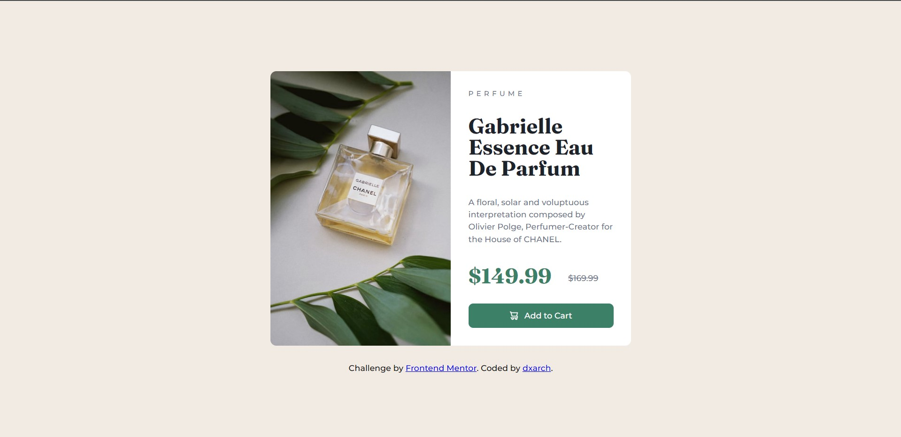

# Product preview card component

This is a solution to the [Product preview card component challenge on Frontend Mentor](https://www.frontendmentor.io/challenges/product-preview-card-component-GO7UmttRfa). Frontend Mentor challenges help you improve your coding skills by building realistic projects. 

## Table of contents

- [Overview](#overview)
  - [The challenge](#the-challenge)
  - [Screenshot](#screenshot)
  - [Links](#links)
- [My process](#my-process)
  - [Built with](#built-with)
  - [What I learned](#what-i-learned)
  - [Useful resources](#useful-resources)

## Overview

### The challenge

Users should be able to:

- View the optimal layout depending on their device's screen size
- See hover and focus states for interactive elements

### Screenshots

**Desktop**



**Mobile**


### Links

- [Live Site URL ](https://dxarch.github.io/product-card-component/)

## My process

### Built with

- Semantic HTML5 markup
- CSS custom properties
- CSS variables
- Flexbox
- Mobile-first workflow

### What I learned

This is my first project in which I have learned Flexbox and Mobile-first workflow in practice. 
I have spent hours trying to center the card and make the product image height match the height of it's description though :grin:
However, I'm very satisfied with the result and the process of styling the page.

```html
<h1>Some HTML code I'm proud of</h1>
```
```css
@media screen and (min-width: 1400px) {
    .product__info {
        border-top-right-radius: 10px;
        border-bottom-right-radius: 10px;
        align-self: stretch;
        padding: 30px;
    }

    .product__info>* {
        padding-bottom: 15px;
    }

    .product__info button:last-child {
        padding-bottom: 0;
    }
}
```
### Useful resources

- [Flexbox cheatsheet](https://css-tricks.com/snippets/css/a-guide-to-flexbox/) - Used this complete guide to get better understanding of Flexbox


